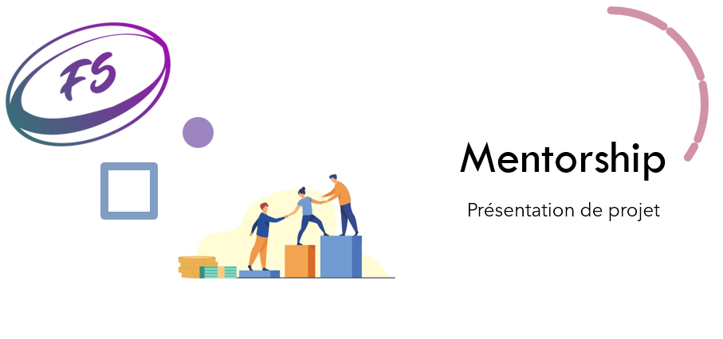

Identify the customer's needs to design the application - FuzeScrum
---------
## Technical:

1. Agile 
2. User Stories
3. Identify the customer's needs
4. design an application
5. Creation of a domain model
6. redaction of the documentations

